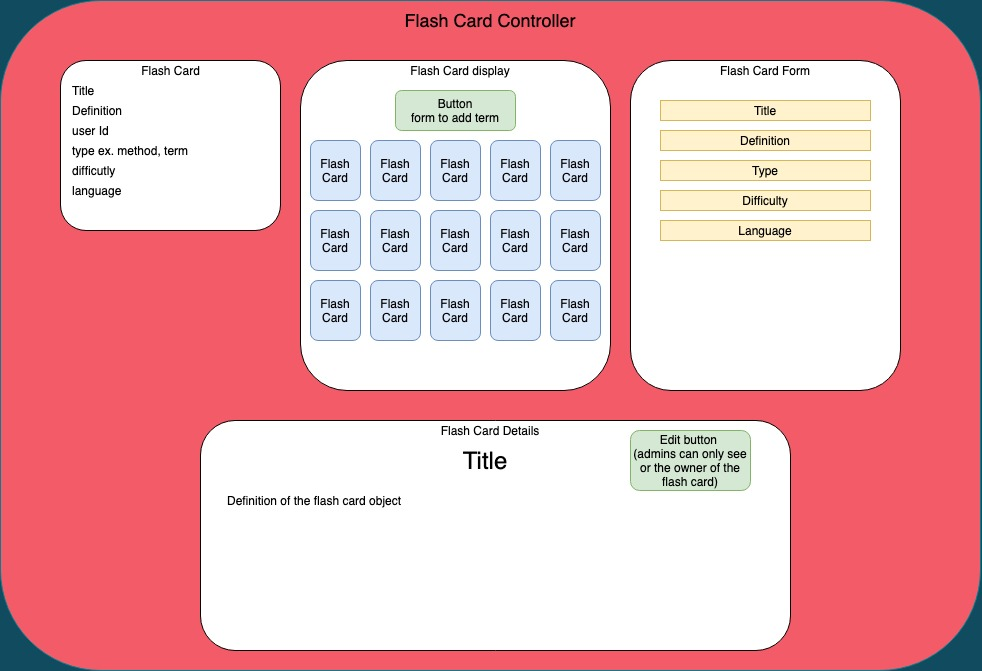

# Flashers

#### Author: Jozy Kinnaman, Allison Mackey & Josh Hellman

### Description
A webpage that allows users to enter in a 'flashcard' to study tech terms & see terms by other users as well. 

### Setup/Installation Requirements

View detailed set up instructions [here](./INSTALL.md)

### Known Bugs

No known bugs at this time. 

## Support and Contact Information

_Have a bug or an issue with this application? [Open a new issue](https://github.com/amackey693/brewery/issues) here on GitHub._

## Technologies Used

JavaScript, React, Redux, Firebase, JSX, HTML, Node.js, Git and GitHub

## Specs

1. Allows user to create, read, update & delete flashcards
2. Allows user to submit their own flashcards to a database & associate it to that particular user 
3. Allows user to sign up, sign in & sign out
4. Allows user to see their own 'dashboard' with the flashcards they've created
5. Allows user to see 'feed' with flashcards created by all users or main database

Stretch Goals: 
6. Allows user to see flashcards by challenge level: easy, med, difficult ?
7. Allows user to add flashcards from 'feed' to their own 'dashboard' ?
8. Allows users to select language: JavaScript, Basic Programming Terms, add other languages if we're able. 

TO DO LIST 
1. handleChangingSelectedCard function 
2. FlashCardDetail 
3. selected card state

### License

This software is licensed under the MIT license.

Copyright © 2020 **_Jozy Kinnaman, Josh Hellman & Allison Mackey, Epicodus_**